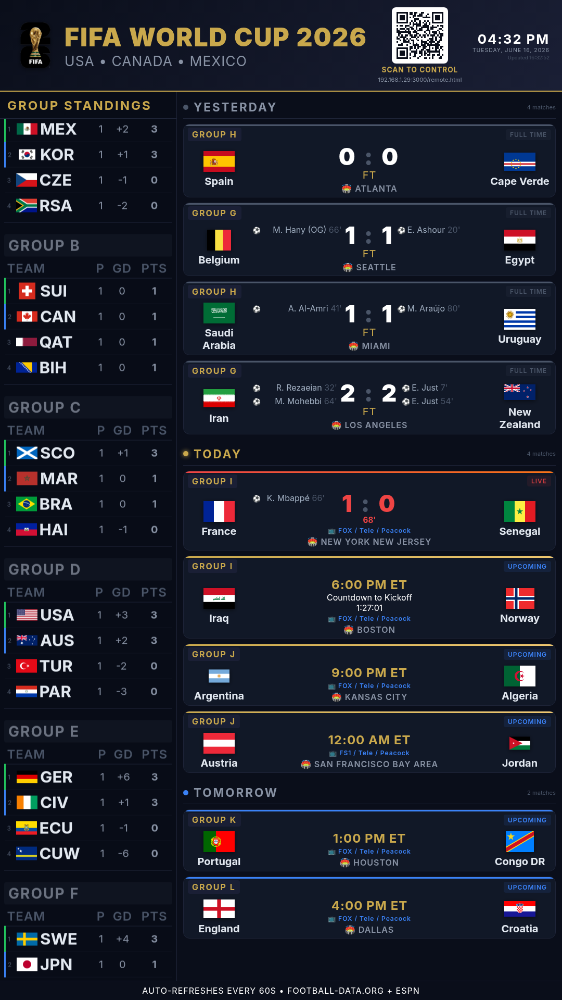

# FIFA World Cup 2026 Dashboard

A self-updating live dashboard for Raspberry Pi displaying fixtures, live scores, standings, and match events for the 2026 FIFA World Cup — with a mobile-friendly remote that lets anyone on the network refocus the screen on a single country or a single day.



## Features
- Live scores, scorers, red cards, and match minute via ESPN
- Group standings with real-time updates during matches
- Rolling 10-match fixture window (past and upcoming)
- Qualification status indicators
- Match animations (goals, kickoff, halftime, fulltime, red cards)
- Goal scorer headshot overlays
- **Mobile remote control** — scan the on-screen QR code (or open a URL) to refocus the dashboard from any phone or computer on the same network
- **Country focus** — show all of a selected team's World Cup matches; the standings pane scrolls to and highlights that team's group
- **Date focus** — show every match scheduled for a selected day (bounded to the tournament dates)
- **Auto-reset** — a country/date focus automatically clears after 2 minutes, so the screen returns to the default view if someone forgets to reset it
- Auto-refreshes every 60 seconds (ESPN every 30s); interval is configurable
- Quiet hours: no API calls 2:20 AM to 11:40 AM ET
- Auto-shutdown at 2:30 AM ET every night

## Hardware Requirements
- Raspberry Pi 4B (4GB RAM recommended)
- Monitor (tested on 1080x1920 portrait orientation)
- MicroSD card (32GB recommended)

## Operating System
Raspberry Pi OS Desktop 64-bit — the full desktop version is required (not Lite) for Chromium kiosk autostart to work correctly.

## Display
The dashboard is designed for a vertically mounted display. The monitor is physically rotated to portrait orientation, and the OS display rotation is configured accordingly. Target resolution: 1080x1920 (landscape 1920x1080 monitor rotated 90 degrees).

## Data Sources
- **football-data.org** — fixtures and standings (free API key required)
- **ESPN public scoreboard API** — live scores, scorers, TV channels (unofficial, no key required)

> Note: The ESPN API is unofficial and undocumented. It may change without notice.

## Setup

### 1. Clone the repo
```bash
git clone <your-repo-url>
cd dashboard
```

### 2. Get a free API key
Register at: https://www.football-data.org/client/register

### 3. Run the installer

This will: install Node.js if needed, install dependencies, prompt for your API key, configure the Node server as a system service, set up Chromium kiosk autostart, configure display rotation, and schedule auto-shutdown.

> Dependencies (`express`, `dotenv`, `node-fetch`, `qrcode`) are installed from `package.json` via `npm install`.

### 4. Reboot

The dashboard will launch automatically on boot.

### 5. Find your Pi's IP (optional, for SSH or manual remote access)
```bash
hostname -I
```

## Remote Control

The dashboard can be refocused from any phone or computer on the same network. The view is shared: anyone can change it, and the most recent selection wins.

**Opening the remote**
- **Scan the QR code** shown in the dashboard header ("Scan to control") with a phone camera, or
- Open the remote URL directly:
  - `http://<pi-ip>:3000/remote.html` — works on any device (recommended), or
  - `http://<hostname>.local:3000/remote.html` — works on devices that support mDNS/Bonjour (macOS, iOS, most Linux; Windows needs Bonjour installed)

The QR code is generated at runtime from the device's own IP address, so it works on any network without editing anything.

**Using the remote**
- **By Country** — pick a team from the dropdown (with crests). The dashboard switches to all of that team's World Cup matches (completed and scheduled), and the standings pane jumps to and highlights the team's group.
- **By Date** — pick a day within the tournament window. The dashboard shows every match scheduled for that day.
- **Return to Default (Show All)** — reverts to the normal rolling fixture window.

**Auto-reset**
- Any country or date focus clears automatically after **2 minutes**. Selecting again resets the countdown. The dashboard and any open remote return to the default view within a few seconds.

## Configuration
- **Refresh interval** — set `REFRESH_MS` near the top of the script in `public/index.html` (default `60000` ms). The footer label updates to match automatically.
- **Focus timeout** — set `FOCUS_TIMEOUT_MS` in `server.js` (default `2 * 60 * 1000`).
- **Time zone / quiet hours / auto-shutdown** — configured for US Eastern; adjust in `server.js` and the shutdown schedule if hosting elsewhere.

## Notes
- `.env` is gitignored — never commit your API key
- The dashboard is designed for a vertically mounted 1080x1920 display
- The monitor is physically rotated 90 degrees to portrait orientation
- Auto-rotates display on boot via autostart configuration
- The Pi shuts down automatically at 2:30 AM ET every night — simply power it back on in the morning before games begin
